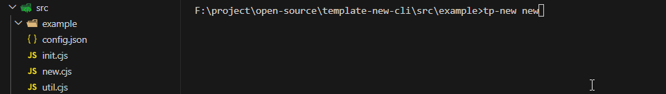
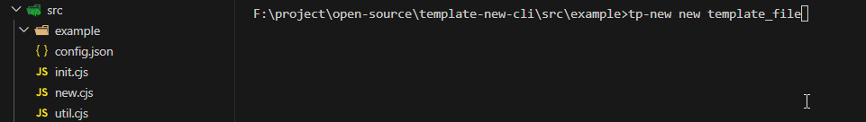
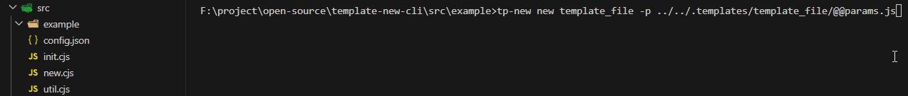

<h1 align="center">template-new-cli</h1>

<p align="center">
  
   <a href="https://github.com/shilim-developer/template-new-cli/blob/master/LICENSE">
    
  </a>
</p>

<div align="center">
<strong>
<samp>

[English](README.md) | 简体中文

</samp>
</strong>
</div>

## 内容目录

<details>
  <summary>点我 打开/关闭 目录列表</summary>

- [项目介绍](#项目介绍)
- [博客网站](#博客网站)
- [功能介绍](#功能介绍)
- [安装](#安装)
- [模板准备](#模板准备)
- [开始使用](#开始使用)
  - [初始化](#初始化)
  - [未指定模板创建](#未指定模板创建)
  - [指定模板创建](#指定模板创建)
  - [使用全局参数](#使用全局参数)
  - [使用文件参数](#使用文件参数)
- [更新记录](#更新记录)
- [许可证](#许可证)

</details>

## 项目介绍

一个通过nunjucks模板文件根据参数生成文件的cli工具

## 博客网站

待更新

## 功能介绍

- 通过 nunjucks 模板生成文件
- 提供命令行和js文件两种方式提供参数

## 安装

```sh
npm install template-new-cli -g
```

## 模板准备
### 模板目录结构

```
.templates                          
├─ template_file         (模板名称) [单文件模板]
│  └─ @@config.js        (模板可替换参数列表配置文件)
│  └─ @@params.js        (模板替换参数对象) [可选]
│  └─ file_name.js       (模板文件)               
├─ template_folder       (模板名称) [文件夹模板]
│  └─ @@config.js        (模板可替换参数列表配置文件)
│  └─ component_name     (模板文件夹)    
│     └─ file_name.css     
│     └─ file_name.html 
│     └─ file_name.js 
├─ callback.js           (回调函数)    
└─ global.js             (全局参数文件)
```
### @@config.js

```javascript
exports.fileParams = ["file_name"];
exports.templateParams = [];
```
### @@params.js
```javascript
module.exports = () => {
  return {
    fileParams:{
      file_name: 'helloworld',
    },
    templateParams:{
      content: 'hello',
    }
  };
};
```
### 模板文件
使用  [nunjucks](https://github.com/mozilla/nunjucks)

## 开始使用

### 初始化
为了确认 .templates 的位置，需要在 .templates 所在目录执行初始化操作
```sh
tp-new init
```

### 未指定模板创建
进入要创建文件的目录，执行
```sh
tp-new new
```


### 指定模板创建
进入要创建文件的目录，执行
```sh
tp-new new [模板名称]
```


### 使用全局参数
配置global.js
```javascript
module.exports = () => {
  return {
    prefix: "tp",
  }
}
```
进入要创建文件的目录，执行
```sh
tp-new new [模板名称]
```


### 使用文件参数
配置@@config.js
```javascript
exports.fileParams = [];
exports.templateParams = [];
```
配置@@params.js
```javascript
module.exports = () => {
  return {
    fileParams:{
      file_name: 'helloworld',
    },
    templateParams:{
      
    }
  };
};

```
进入要创建文件的目录，执行
```sh
tp-new new [模板名称] -p [参数文件路径]
```


## 更新记录

[ChangeLog](./CHANGELOG.md)

## 许可证

[License MIT](./LICENSE)
